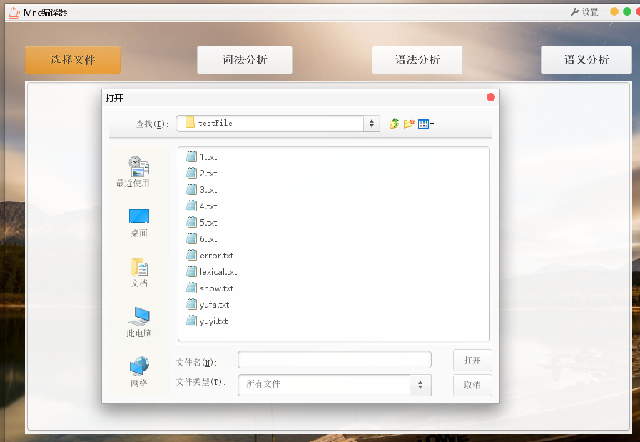
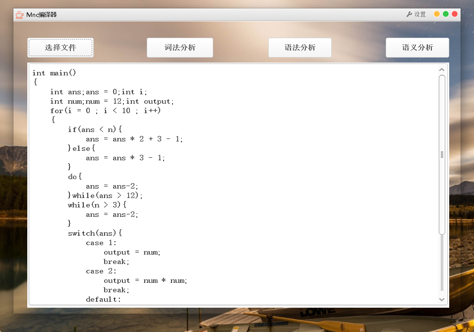
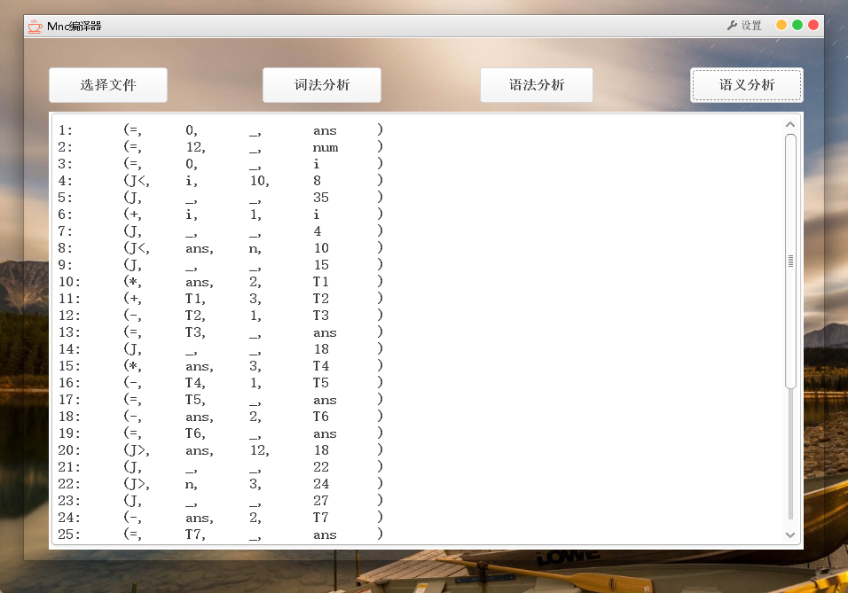
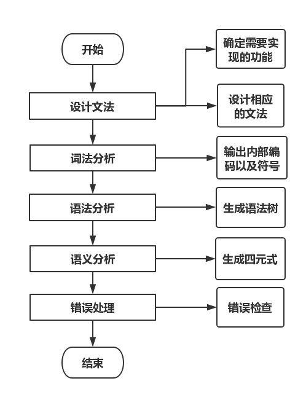

# Mnc-javacc
Implementing the Minic compiler with javacc

---

编译原理课程实习：

### 功能要求

1. 用流的形式读入要分析的MiniC源程序。

2. 能够根据单词的构词规则，完成MiniC语言中的单词的解析(词法分析)，如果不符合单词的构词规则，请给出错误信息。如果源语言符合单词的词法规则，请输出<单词种别，单词自身值>二元式。（注：利用JavaCC实现）

3. 在词法分析的基础上，构造MiniC的递归下降分析文法，利用JavaCC实现递归下降分析文法。判断源语言是否符合MiniC的语法，如果符合，输出语法树；否则，请给出语法错误信息。

4. 在语法分析的基础上，根据属性文法制导翻译，进行语义分析，输出四元式。如果源语言不符合MiniC的语义，请指出错误信息。

5. 在平时实习课的基础上，整个编译系统要能够翻译声明语句、数组(二维，多维)翻译，数学表达式、关系表达式、布尔表达式，if-else, for, while，do-while，switch-case，赋值等语句嵌套的分析与翻译。

6. 实现符号表，并能够检查变量重复声明、使用时未定义错误。

7. 实现扩展内容：
   1. 扩展内容：可以考虑多个函数及函数调用翻译。
   2.  扩展内容：可以添加功能，如break、continue、return语句、一维指针。
   3.  扩展内容：可以检查赋值精度错误、函数参数类型不匹配错误、静态数组元素下标越界错误、break错误、continue错误等。
   4.  扩展内容：为编译器添加界面。

### 实现的功能

(1) 采用流的形式读入要分析的MiniC源程序。

(2) 编写一个简单的编译器界面来对成果进行展示。

(3) 实现词法分析和语法分析，并将其结果输出到文件。

(4) 实现语义分析，主要有：声明语句、数学表达式、关系表达式。

(5) 实现if-else, for, while，do-while，switch-case，赋值等语句嵌套的分析与翻译。

(6) 实现符号表，能检查变量的重复声明，使用时未定义错误。

### 界面展示







### 设计思路



### 文法设计


命名:

```
程序：Program
语句块：StateBlock
语句：State
顺序语句：SeqState
分支语句：BranchState
循环语句：LoopState

条件语句：IfState
switch语句：SwtichState

while语句：WhileState
dowhile语句：DoWhileState
for语句：ForState

自增自减语句：AutoAS
声明语句：DecState
赋值语句：AssState
break语句： BreakState

类型：Type
表达式：Expression
条件：BoolExpression
条件：Condition
逻辑运算符：LogicalOperator
运算符：Operator
关系符：Relation
```

文法：

```
<程序> -> <类型> main "(" (<类型> ID)* ")" <语句块>
<语句块> -> <语句> | { <语句块>*}
<语句> -> <顺序语句> | <分支语句> | <循环语句>
<顺序语句> -> (<声明语句> | <赋值语句> | <break语句> | <自增自减语句>) ";"
<声明语句> -> <类型> ID (,ID)*
<类型> -> int | void | double | float | char
<赋值语句> -> ID = <表达式>
<break语句> -> break

//分支部分： 包括if-else和switch结构
<分支语句> —> <条件语句> | <switch语句>
<switch语句> -> switch"(" ID ")" 
"{" 
(case <表达式> ":" <语句块> <break语句>)*
 (default ":" <语句块> <break语句>)?
 (case <表达式> ":" <语句块> <break语句>)*
 "}"
<条件语句> -> if "(" <条件> ")" <语句块> (else <语句块>)？
//循环部分： 包括while，do-while,for三个结构
<循环语句> -> <while语句> | <doWhile语句> | <for语句>
<while语句> -> while "(" <条件> ")" <语句块>
<doWhile语句> -> do <语句块> while"(" <条件> ")" ";"
<for语句> -> for "(" <赋值语句> ? ";" <条件> ";" <赋值语句>? ")" <语句块>
<条件> -> <条件> (<逻辑运算符> <条件>)*
<条件> -> <表达式>(<关系符> <表达式>)?
<表达式> -> 默认javacc
<运算符> -> + | - | * | /
<关系符> -> < | <= | >= | == | !=
<逻辑运算符> -> "&&" | "||"
```

### 测试文件

> 1.txt--if else

```c
int main()
{
    int a;
    int b;
    if(a > 0)
    {
        a = -1;
    }
    else
    {
        b = -1;
    }
}
```

> 2.txt--for

```c
int main()
{
    int a;
    a = 0;
    int i;
    for(i = 0 ; i < 10 ; i++)
    {
        a = a+1;
    }
}
```

> 3.txt -- do-while

```c
int main()
{
    int a;
    a = 0;
    int c;
    c = n;
    do
    {
        a = a+1;
        n = n-1;
    }
    while(n>0);
}
```

> 4.txt -- switch-case

```c
int main()
{
    int a;
    a = 2;
    int output;
    switch(a)
	{
        case 1:
        	output = 2;
        	break;
        case 2:
        	output = 1;
        	break;
        default:
        	output = 3;
        	break;
	}    
}
```

> 5.txt - 嵌套测试

```c
int main()  
{  
    int ans;ans = 0;int i;  
    int num;num = 12;int output;
    for(i = 0 ; i < 10 ; i++)  
    {
        if(ans < n){  
            ans = ans * 2 + 3 - 1;  
        }else{  
            ans = ans * 3 - 1;  
        }  
        do{
            ans = ans-2;  
        }while(ans > 12);   
        while(n > 3){  
            ans = ans-2;          
        }  
        switch(ans){
            case 1:
                output = num;
                break;
            case 2:
                output = num * num;
                break;
            default:
                output = 0;                
        }
    }
    int ans;
}  
```

> 6.txt while

```c
void main()
{
    int i;
    int j;
    while(i < j)
    {
        i = i+2;
        j = j-2;
    }        
}
```

